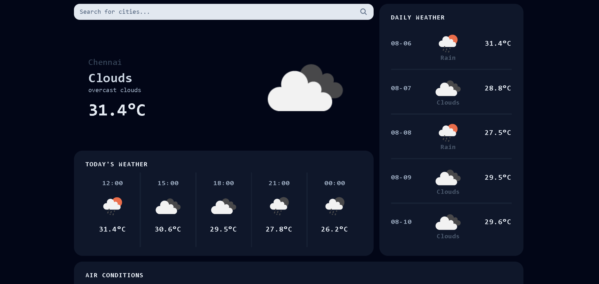

# Weather App

## Preview 
🚀🚀🚀Site Live on [Github Pages](https://anand-sk1324.github.io/WeatherApp/)


## Tech Stack
- 🚀 Astro
- 🧪 React
- 💄 Tailwindcss

## Api Usage
- Weather Api - [Open Weather](https://openweathermap.org/api)
- Geo Location Api - [Rapid Api](https://rapidapi.com/damngoodapis/api/geolocation)
  
## Features
- Current Weather and Other Details
- Hourly and Daily Forcast Weather
- Weather Details for any city
- Responsive Design

## User Guide
- Download the zip file and extract or clone the repository
- Open the folder containing package.json in terminal
- run the following commands
  ```sh
  npm install
  npm run dev
  ```
- That's it your project should be run in http://localhost:4321/

Note: Feel free to contact for any issues: [anand.sk1324@gmail.com](mailto://anand.sk1324@gmail.com/)
